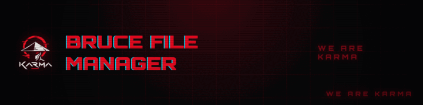
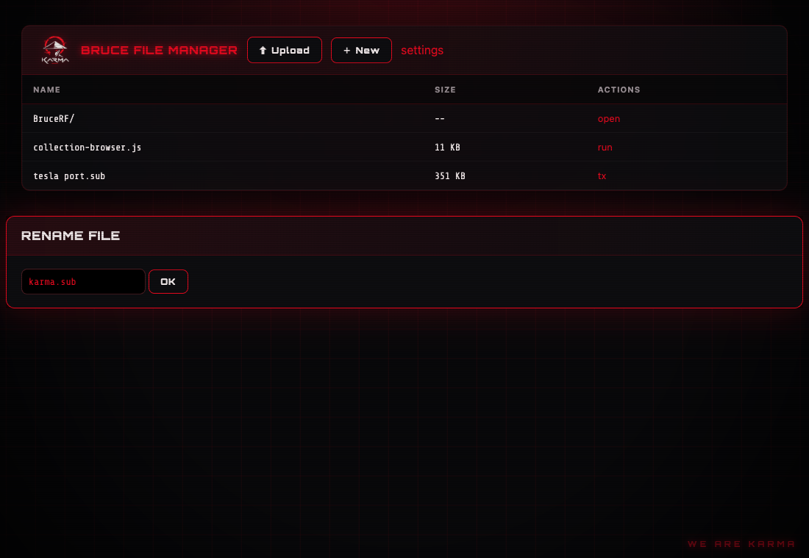
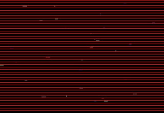
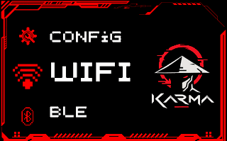

# Red Karma Cyberpunk — Bruce theme pack

A cyberpunk red-on-black theme for the [Bruce](https://github.com/BruceDevices/firmware)
ESP32 firmware. Two parts:

- **WebUI skin** — reskins the browser file-manager served at `http://bruce.local`.
- **Device screen theme** — the *Cyberpunk 2077 – Red Karma Edition* on-device theme, in **RGB** and
  **BRG** panel variants (animated icons, boot animation, boot sound).

Accent **`#E5091E`** on black. `WE ARE KARMA`. 🔴

---

## WebUI skin — `webui/theme.css`

A single self-contained CSS file: fonts (Orbitron + Share Tech Mono) and the Karma logo are
embedded as base64, so it works fully offline. It overrides the three real Bruce WebUI variables
(`--color`, `--background`, `--light-color`) and adds an animated grid background, CRT scanlines,
neon buttons, a title glitch and a `WE ARE KARMA` signature. Respects `prefers-reduced-motion`.

**How to apply.** A custom WebUI stylesheet is not an officially documented Bruce feature, so pick
whichever fits your build:
- If your build serves a user CSS from the SD card, drop `theme.css` where it expects it.
- Otherwise inject it client-side with a browser extension such as **Stylus**, scoped to
  `bruce.local`, pasting the file's contents. It must load **after** the WebUI's own stylesheet.

To recolor only (no fonts/effects), keep just the `:root { --color / --background / --light-color }`
block at the top.

---

## Device screen theme — `device-theme/`

The *Cyberpunk 2077 – Red Karma Edition* theme for a 320×240 (CYD / Core) screen: **animated GIF
icons**, an animated **boot splash** (`boot.gif`), a **boot sound** (`boot.wav`), and RGB565 colors.

Two variants are provided because cheap TFT/CYD panels come in different subpixel orders, and Bruce
does not correct for it — so the same red shows as blue on a mismatched panel. The **BRG** variant is
the whole theme with the red/blue channels pre-swapped (colors **and** images).

| Variant | Folder | `priColor` | Use when |
|---|---|---|---|
| **RGB** | `device-theme/Cyberpunk-2077-Red-Karma-RGB/` | `F800` (red) | Reds show as red — most panels. |
| **BRG** | `device-theme/Cyberpunk-2077-Red-Karma-BRG/` | `001F` (pre-swapped) | Reds show as **blue** with the RGB theme. |

Both share `secColor` `FFFF` (white) and `bgColor` `0000` (black), a red LED (`ledColor ff0000`), and
the full animated icon set (`wifi`, `ble`, `rf`, `nrf`, `lora`, `fm`, `ir`, `ethernet`, `gps`, `rfid`,
`files`, `interpreter`, `clock`, `others`, `config`).

**Install.** Copy the chosen folder onto the device (SD card or LittleFS), then on the device:
`Config → UI Theme → (choose filesystem) → select theme.json`.

**Which variant?** Load **RGB** first. If the interface and boot logo come out blue/cyan instead of
red, switch to **BRG**.

---

## Palette

| Layer | Accent | Background | Secondary |
|---|---|---|---|
| WebUI (CSS) | `#E5091E` | `#000000` | derived `--light-color` |
| Device RGB (RGB565) | `F800` | `0000` | `FFFF` |
| Device BRG (RGB565) | `001F` | `0000` | `FFFF` |

---

## Credits

Pack assembled by Team Karma. Device theme: *Cyberpunk 2077 – Red Karma Edition* (Bruce App Store
community theme). Logo © Team Karma. Not affiliated with the Bruce project. Use at your own risk.
